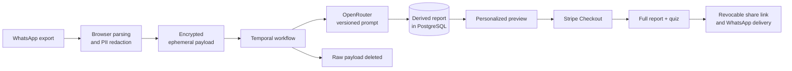

<p align="center">
  
</p>

<h1 align="center">Roastin Has Notes</h1>

<p align="center">
  <strong>Turn years of WhatsApp chaos into the report nobody in the chat would dare to write.</strong>
</p>

<p align="center">
  A private, editorial-grade group roast built from real messages, recurring disasters and painfully specific receipts.
</p>

<p align="center">
  <a href="https://github.com/RolandVrignon/roastin-has-notes/actions/workflows/ci.yml"></a>
  
  
  
  
  
</p>

---

> **This is not a chat summary.** Roastin reads the room, finds the patterns nobody admits to, quotes the evidence and turns the whole thing into a beautifully designed magazine about the group.

## The pitch

Every group chat already contains a cast of characters, a private language and years of accidental comedy. The problem is that the best material is buried under thousands of messages.

Roastin turns a WhatsApp export into a sharp, highly personalized report that feels written by the one friend who remembers everything — except this friend has timestamps, statistics and receipts.

**Upload the chat. Meet the characters. Read the evidence. Share the damage.**

## What comes out

| The report | What makes it hit |
|---|---|
| **The opening act** | A custom headline and editorial intro that could only belong to this chat. |
| **Individual portraits** | Specific roasts, conversational personalities, strengths and chaos triggers for every participant. |
| **WhatsApp receipts** | Exact quotes dropped between paragraphs as familiar message bubbles — the evidence lands at the punchline. |
| **Awards & dictionary** | Recurring phrases, running jokes and titles the group will immediately recognize. |
| **Group dynamics** | Alliances, habits, green flags, yellow flags and gloriously avoidable disasters. |
| **The final verdict** | One last callback-heavy mic drop written for the entire cast. |
| **The group quiz** | An optional paid add-on generated from the existing report — no second upload and no second AI analysis. |

The default voice is **very observant, slightly brutal and always grounded in the conversation**. Roastin targets behaviour, never identity, appearance, trauma or sensitive traits.

## One smooth, mobile-first experience

1. **Drop the receipts** — upload a WhatsApp `.txt` export or its `.zip` archive.
2. **Set the scene** — choose the relationship and context in a few taps.
3. **Name the cast** — keep first names, replace surnames or use the nicknames the group actually knows.
4. **Verify at the last responsible moment** — the WhatsApp number is requested only after the chat is ready, keeping the first interaction frictionless.
5. **Read before paying** — a personalized preview proves the quality before Stripe reveals the one-time price.
6. **Unlock, share, replay** — the full report opens on the same URL, the private link can be delivered through WhatsApp, and the owner can add the interactive quiz.

No subscription. No generic questionnaire. No fake countdown. No “your friend is the funny one” filler.

## Built to feel viral. Engineered to survive production.



Under the editorial surface is a real application stack:

- **Durable generation** — Temporal workflows, retry-safe activities and idempotent artifacts keep long AI jobs reliable.
- **Versioned multilingual prompting** — one safety and quality contract, plus locale-specific editorial direction for 8 localized experiences.
- **Measured AI economics** — the exact model, token usage, generation cost in USD and EUR, and exchange-rate snapshot are persisted per report.
- **Real entitlements** — Stripe Checkout Sessions and signed webhooks unlock Classic and Quiz independently.
- **Phone-first identity** — WhatsApp OTP replaces email accounts; encrypted phone storage and blind indexes keep recovery practical without storing plaintext identifiers.
- **Shareable by design** — private, expiring links can be revoked, anonymize participant names or hide quotes.

## Privacy is part of the product

The chat is intimate. The architecture treats it that way.

- Parsing starts in the browser and obvious contact data is redacted before generation.
- The raw conversation is stored only as an encrypted ephemeral payload while the workflow runs.
- The source payload is deleted after generation; PostgreSQL keeps the derived report, not the original chat.
- Reports are private by default and owner-controlled share links are revocable.
- WhatsApp numbers are encrypted at rest and looked up through a keyed blind index.
- Chats that may involve minors are rejected, and the roast safety contract forbids sensitive inference, slurs and identity-based attacks.
- Account export, report deletion, link revocation and delivery-data removal are built in.

## International from the first message

Roastin ships complete localized product journeys — landing page, onboarding, report voice, checkout, account and legal copy — for:

`English` · `Français` · `Español` · `Deutsch` · `Italiano` · `Português` · `Português do Brasil` · `Nederlands`

The humour is culturally directed, not translated word for word.

## A business model built into the experience

```text
Upload → personalized preview → one-time unlock → group share → next creator
```

- **Classic Report — €11.99:** the complete editorial report, including every participant's conversational personality.
- **Group Quiz — €4.99 add-on:** created deterministically from the report's existing quotes, awards and expressions, with no second AI generation cost.
- **Price appears after proof:** the onboarding stays curiosity-first; the offer is revealed only after the user has seen a genuinely personalized preview.
- **The output is the acquisition channel:** every shared report puts the product in front of the exact people most likely to create the next one.
- **Unit economics stay observable:** model identity, token usage and generation cost are recorded per report so quality and margin can be improved together.

No subscription fatigue. One memorable purchase, then a natural reason to bring the whole group in.

## Technology

| Layer | Stack |
|---|---|
| Product | Next.js 16, React 19, TypeScript 5.9, Tailwind CSS 4 |
| Data | PostgreSQL 17, Prisma ORM 7 |
| Durable AI | Temporal, OpenRouter, versioned structured-output prompts |
| Commerce | Stripe Checkout, signed webhooks, per-product entitlements |
| Identity & delivery | Meta WhatsApp Business Platform Cloud API |
| Operations | Docker Compose, Caddy, dedicated worker, GitHub Actions |
| Quality | Vitest, ESLint, production build and Compose validation |

## Run it locally

### Requirements

- Node.js 22+
- pnpm 11.5.1
- Docker with Compose

### Start the complete stack

```bash
git clone git@github.com:RolandVrignon/roastin-has-notes.git
cd roastin-has-notes

corepack enable
pnpm install
pnpm setup:env
pnpm prisma generate
docker compose up -d --build
```

Then open:

- **Roastin:** [http://localhost](http://localhost)
- **Temporal UI:** [http://localhost:8080](http://localhost:8080)

`pnpm setup:env` creates missing local secrets and empty provider slots without printing secret values. It also enables development OTPs and demo payments for the local environment, so the full journey works without external credentials; report generation falls back to deterministic demo content when OpenRouter is absent. Those fallbacks are rejected outside `DEPLOYMENT_ENV=local`.

### Run web and worker outside Docker

```bash
docker compose up -d postgres temporal-postgres temporal-server
pnpm dev
pnpm worker
```

### Connect the real providers

Copy and complete [`.env.example`](./.env.example):

| Provider | Required configuration |
|---|---|
| OpenRouter | `OPENROUTER_API_KEY`, `OPENROUTER_MODEL` |
| Stripe | Secret key, publishable key, webhook secret and Classic/Quiz price IDs |
| WhatsApp Cloud API | Access token, phone-number ID, app secret, verify token and approved authentication/report templates |
| Application security | Database passwords, payload/data encryption keys, phone hash secret and auth secret |

Never commit `.env`. Local fallbacks are rejected outside the local deployment environment.

## Quality gate

```bash
pnpm test
pnpm lint
pnpm build
docker compose config --quiet
```

The same gate runs in GitHub Actions on every pull request and every push to `main`, including a committed-secret scan.

## Repository map

```text
src/app/          Next.js pages, account surfaces and API routes
src/components/   Landing, onboarding, report, quiz and account UI
src/domain/       Versioned report contracts
src/server/       Auth, report generation, storage and provider boundaries
src/temporal/     Workflows, activities, schedules and worker
src/i18n/         Eight locale dictionaries and editorial instructions
prisma/           PostgreSQL schema and migrations
branding/         Visual directions and source brand explorations
content/          Launch content and editorial material
docs/             Provider setup and operating notes
```

## Product documents

- [Product brief](./Brief.md) — vision, experience principles, editorial contract and launch scope.
- [Business plan](./BUSINESS_PLAN.md) — pricing, unit economics, acquisition thesis and scale gates.
- [WhatsApp setup](./docs/whatsapp-setup.md) — Meta app, templates, webhook and launch checklist.

---

<p align="center">
  <strong>The chat. The receipts. The mic drop.</strong><br />
  <sub>Private beta · Built for the group that has far too much history.</sub>
</p>
